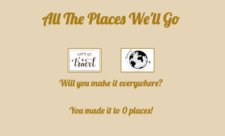
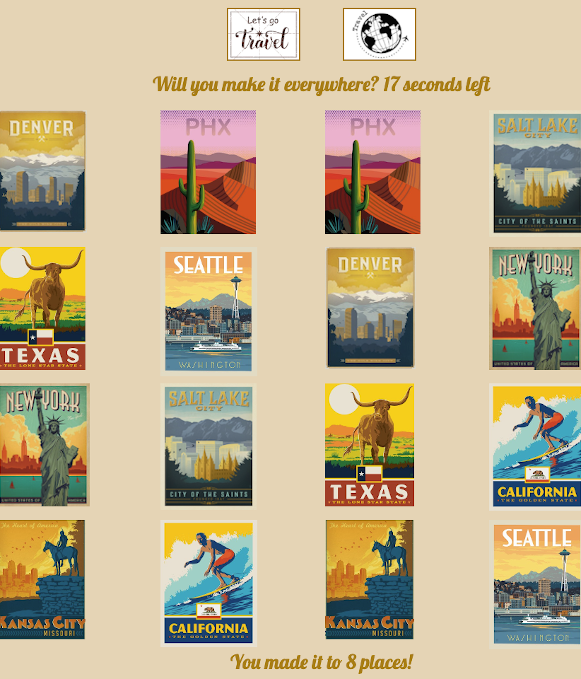
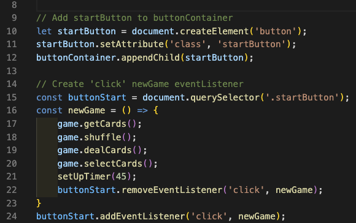
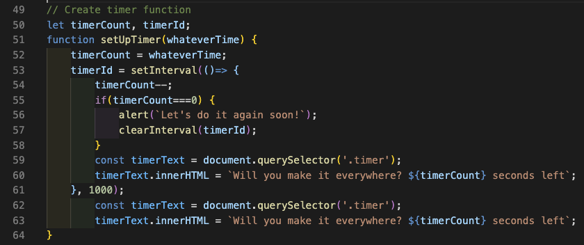
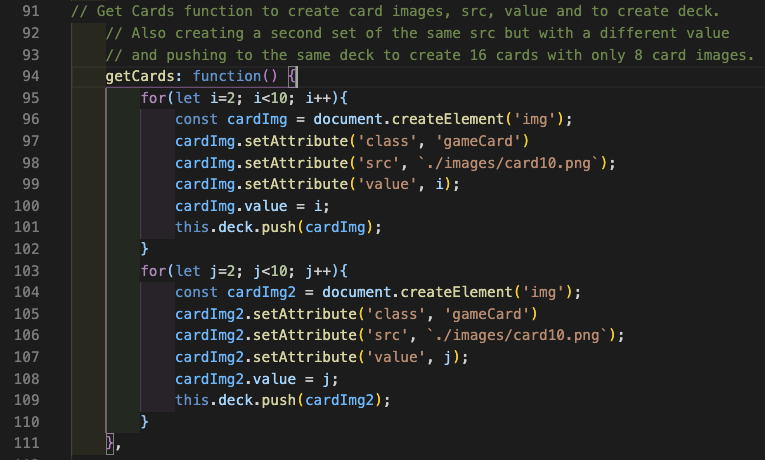
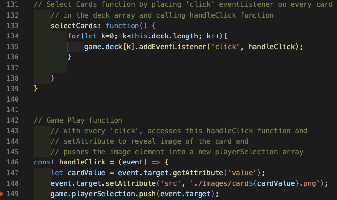

# "All The Places We'll Go"

### About

This memory game is a representation of all the places cohort 921 is from. It was created to hopefully inspire us to one day travel to all the different places and meet in person. 

### Development Approach

#### User Stories

- The player will click on the "Let's go travel" button to start the game.
- Once you start the game, the timer will start counting down from 45 seconds.
- The player will click on two cards at a time to see if they match. 
- If the two cards match, cards will stay facing up and add count to how many places they've been.
- If the two cards do not match, cards will flip back over and hide the images.
- If the player matches all 8 pairs OR if the timer runs out, it ends the game.
- The player can click on the "Travel Globe" button to refresh and play another game.

#### Design Approach

For the planning of this game, I researched how many different cities were represented in the cohort and narrowed it down to 8 places to build a 4x4 grid, 16 squares. 

1st Page starts with:
- header
- "Let's go travel" (start button)
- "Travel Globe" (refresh button)
- "Will you make it everywhere?" (timer question) 
- "You made it to _ places!" (score phrase)

2nd Page functions:
- gets card images
- shuffles card images
- deals card images
- countdown timer
- score counter
- alerts with timeout and perfect score
- refresh game

### Technologies

### Credits

### Future Features

- Reveal all remaining unmatched card images for a timeout game without a perfect score
- Ability to play another game without reloading the browser and instead, by removing container elements and re-dealing a new shuffled deck.
- Changing alerts to modals
- Creating a function to be able to select a postcard image, enter email and text message to the back card image, and send a virtual postcard via email.
